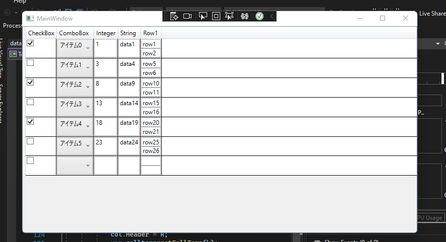

# TofuGrid
in wpf ,  create full custamable datagrid from code behind

# 概要

wpfでもこんな感じに複雑なDataGridを表示したい。
「xamlをつかわずに！！！」

静的な構造であれば、xamlでテンプレートを定義してあげるとスムーズだが、
データ構造が動的な場合、そして受け取ったデータによって表示内容をカスタムしたい場合、それでは対応できない。

そのための方法として、FrameworkElementFactoryを使用した実装が必要となった。
やってみたら案外面白かったので、ついでにGitHubに記録しておく。
これでデータを定義すれば好きなDataGridが表示できる！しかもちゃんとバインディングしてるぜ。

